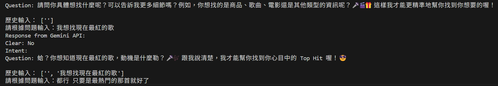
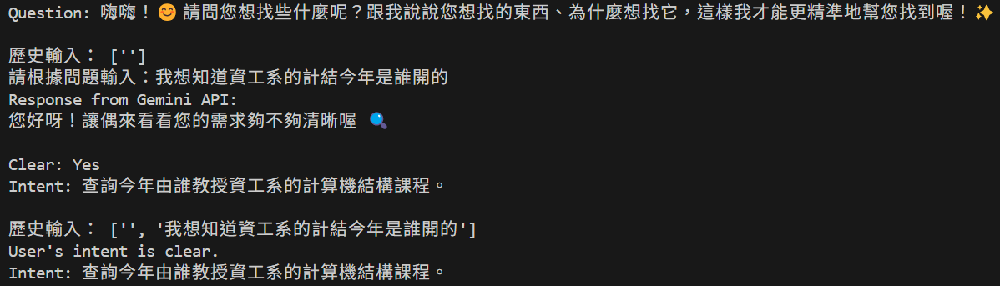
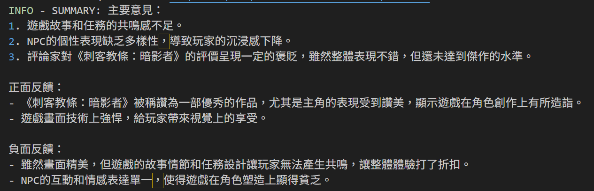
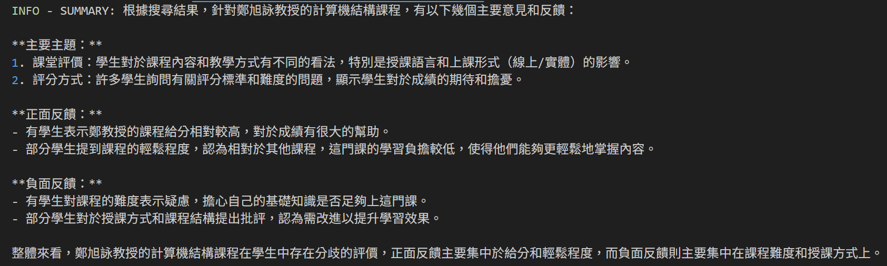
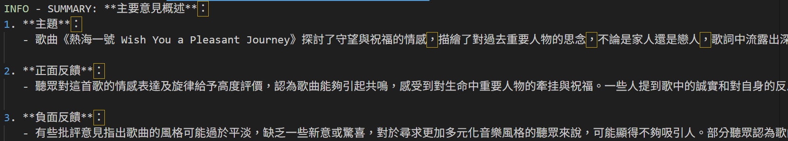

## Assignment 2 - Reflection + Multi-Agent ##
> [!note]
> **核心功能：**<br>
> (1) 新增 Planner，使 Search Agent 可以根據步驟思考如何操作<br>
> (2) 新增意圖確認，當使用者任務不明確時機器人會與使用者對話以確立具體任務 <br>
> (3) 調整 Reviewer，更換模型、修改Prompts，提升糾正效果<br>
> (4) 加入動作紀錄，避免在同一個操作上鬼打牆 <br>
>   
> [我的Repo Link - hertz39xx/AgenticAI_Assignment_2](https://github.com/hertz39xx/AgenticAI_Assignment_2)
> 
**Assigment description:** Improve your AI system by implementing reflection mechanisms and multi-agent collaboration to enhance decision-making and problem-solving capabilities.
Enhance your Assignment 1 system using:
Reflection mechanisms for self-assessment
Multi-agent collaboration for distributed decision-making<br>
This assisgment is edited from [WebVoyager](https://github.com/MinorJerry/WebVoyager)🫡

## Setup Environment ##
For this project, you need a environment with <code>python=3.10</code>

For setup env, please do:
```
$ conda create -n webvoyager python=3.10
$ conda activate webvoyager
$ pip install -r requirements.txt
```

## Quick Start ## 
First, you need create new file <code>.env</code>, which include:
```
OPENAI_API_KEY = 'YOUR_API_KEY_HERE'
GOOGLE_API_KEY = 'YOUR_API_KEY_HERE'
```

Then, you can start this project successfully!
```
$ python run.py
```

## Key Points of this Project ##

### 1. Planner
### 任務開始會先呼叫Planner針對任務意圖做計劃，使後續思考多一個參考：


### 範例輸出紀錄如下，最多包含五個步驟：


### 2. 意圖確認
### Agent 會先與使用者對話以釐清具體任務目標，再將其生成為任務的task query(參見check_user_intent方法)：


### 範例對話過程(當使用者任務只給「鍵盤」兩字時)：


### 範例對話過程(當使用者任務為空白時)：




### 範例Log紀錄：


### 3. Reviewer
### 交互過程範例：
### Agent先生成第一次的動作與想法，接著Reviewer會針對他再次做可行性評估，當Feasible時才會執行

### 若是Not Feasible，則會要求Agent重新生成

### 不可行範例


### 4. 動作紀錄
### 每個任務的Agent動作和想法會被存起來

### 如果發生重複就不會執行，並且會建議Agent採用別的動作

### 警告範例


## Test Cases ###
> 為測試與使用者溝通意圖的能力，故 ques 皆為不完整或空白之輸入。
### 1. Search publisher's info of a game.
```
{"web_name": "google_search", "id": "google_search_task--0", "ques": "Search 刺客教條", "web": "https://google.com"}
```


**Example output:**


### 2. Search the professor of specific course.
```
{"web_name": "course_system", "id": "course--1", "ques": "", "web": "https://cis.ncu.edu.tw/Course/main/news/announce"}

```

**Example summary:**


### 3. StreetVoice Music Ranking Search
```
{"web_name": "street_voice", "id": "street_voice--0", "ques":"", "web": "https://streetvoice.com/"}
```


**Example summary:**

## Citation
Original paper of Webvoyager:
```
@article{he2024webvoyager,
  title={WebVoyager: Building an End-to-End Web Agent with Large Multimodal Models},
  author={He, Hongliang and Yao, Wenlin and Ma, Kaixin and Yu, Wenhao and Dai, Yong and Zhang, Hongming and Lan, Zhenzhong and Yu, Dong},
  journal={arXiv preprint arXiv:2401.13919},
  year={2024}
}
```
